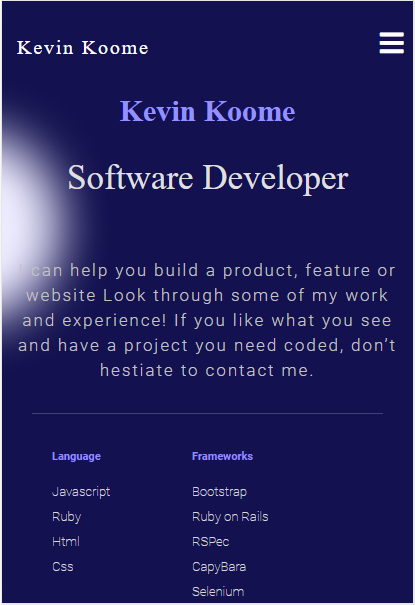

# kevin-koome-portfolio

>This project is meant to set up a skeleton html and css portfolio page containing only the toolbar and headline section and eventually produce a mobile version of the skeleton.

## Built With

- HTML
- CSS

## Live Demo

Deploy to Github pages
https://koomekevo.github.io/kevin-koome-portfolio/

## Getting Started

To get a local copy up and running follow these simple example steps.
* Git clone to your computer.
* Open index.html to view the portfolio.

### Prerequisites

Have a HTML5 compatible browser

## Authors

👤 **Kevin Koome**

- GitHub: [@githubhandle](https://github.com/koomekevo)
- Twitter: [@twitterhandle](https://twitter.com/koomekevo)
- LinkedIn: [LinkedIn](https://ke.linkedin.com/in/kevin-koome-aab84186)

## 🤝 Contributing

Contributions, issues, and feature requests are welcome!

Feel free to check the [issues page](../../issues/).

## Show your support

Give a ⭐️ if you like this project!

## Acknowledgments

- Hat tip to anyone whose code was used
- Inspiration
- etc

## 📝 License

This project is [MIT](./MIT.md) licensed.
